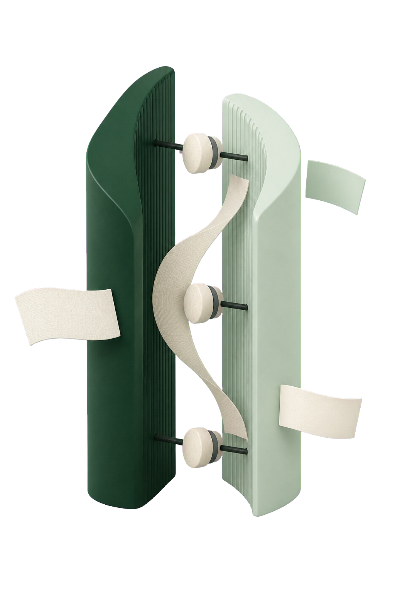
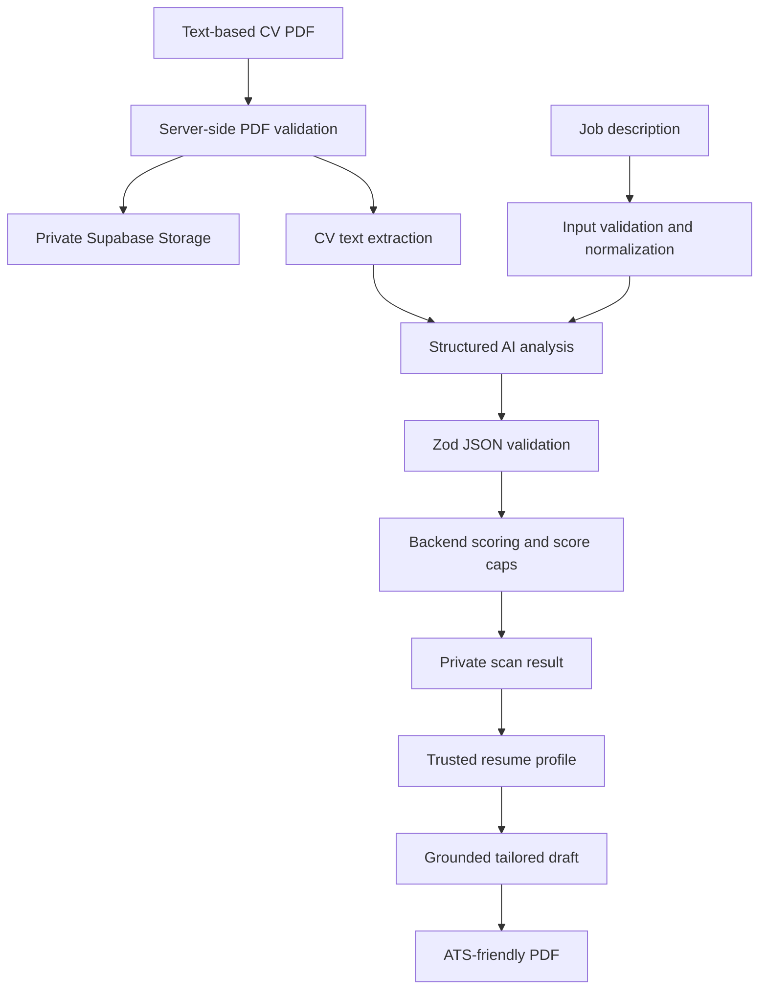

<p align="center">
  
</p>

<h1 align="center">CVMatch</h1>

<p align="center"><strong>Private, job-specific CV analysis with backend-controlled scoring.</strong></p>

<p align="center">
  Upload a text-based CV, paste a job description, review the evidence behind<br />
  the match, and create a grounded tailored resume without inventing experience.
</p>

<p align="center">
  <a href="https://nextjs.org/"></a>
  <a href="https://www.typescriptlang.org/"></a>
  <a href="https://supabase.com/"></a>
  <a href="https://vitest.dev/"></a>
</p>

<br />

<div align="center">
  
  &nbsp;&nbsp;&nbsp;&nbsp;
  
</div>

> CVMatch provides ATS-style feedback. It does not make hiring decisions or
> guarantee job outcomes.

## Contents

- [Overview](#overview)
- [What It Includes](#what-it-includes)
- [How It Works](#how-it-works)
- [Local Setup](#local-setup)
- [Security Model](#security-model)
- [Testing](#testing)
- [Deployment](#deployment)
- [Current Limitations](#current-limitations)

## Overview

CVMatch compares one CV with one job description. The AI provider reads and
structures the evidence, but application code remains responsible for
validation, score calculation, score caps, labels, ownership checks, and safe
data persistence.

The application also includes a grounded resume workflow. Users can review real
CV information, confirm genuine missing experience, generate tailored wording,
preview an ATS-friendly PDF, and download it in English or French.

## What It Includes

- Google OAuth authentication with protected application routes
- Private PDF uploads through Supabase Storage
- Server-side PDF validation and text extraction
- Clear rejection of scanned or image-only PDFs
- Prompt-injection-resistant CV and job-description analysis
- Strict AI JSON validation with Zod
- Deterministic backend scoring, labels, penalties, and caps
- Matched requirements, missing requirements, evidence, and recommendations
- Daily scan, upload, and AI-request limits
- User-owned dashboard, history, results, and deletion workflow
- Grounded tailored-resume generation using trusted facts only
- English and French ATS-friendly resume templates
- Live PDF preview and secure PDF download

## How It Works



### Responsibility Boundaries

| Layer | Responsibility |
| --- | --- |
| AI provider | Reads CV/job text and returns structured evidence or grounded wording |
| Zod schemas | Treat provider and database JSON as untrusted until validated |
| Backend code | Calculates the score, label, caps, and safe explanations |
| Supabase RLS | Restricts scans, results, profiles, and drafts to their owner |
| React UI | Presents safe data and invokes authenticated server actions |

The AI never directly decides the final score or final label.

## Technology

| Area | Technology |
| --- | --- |
| Framework | Next.js App Router, React, TypeScript |
| Interface | Tailwind CSS, shadcn/ui, Motion, Lucide |
| Authentication | Supabase Auth with Google OAuth |
| Database | Supabase Postgres with Row Level Security |
| File storage | Private Supabase Storage bucket |
| Validation | Zod |
| PDF processing | unpdf, React PDF, react-pdf |
| AI integration | Gemini or OpenRouter/OpenAI-compatible APIs |
| Testing | Vitest |
| Deployment | Vercel and Supabase |

## Project Structure

```text
src/
├── app/                 # Routes, layouts, route handlers, loading/error states
├── components/          # Shared UI, marketing, layout, and PDF components
├── features/            # Auth, dashboard, scan, feedback, usage, resume builder
├── lib/                 # AI, PDF, scoring, security, storage, Supabase helpers
└── types/               # Shared application types

supabase/
├── migrations/          # Schema, RLS, storage, usage, and resume migrations
└── seed.sql

docs/                    # Architecture, security, deployment, and feature notes
test/                    # Test-only server module stubs
```

## Local Setup

### Prerequisites

- Node.js 22 or newer
- npm
- A Supabase project
- A Google OAuth application configured through Supabase Auth
- A supported AI provider API key

### 1. Install Dependencies

```bash
npm install
```

### 2. Configure Environment Variables

Create the local environment file from the provided template:

```bash
cp .env.example .env.local
```

Fill in the required values. Never commit `.env.local`.

```dotenv
# Browser-safe Supabase configuration
NEXT_PUBLIC_SUPABASE_URL=
NEXT_PUBLIC_SUPABASE_PUBLISHABLE_KEY=
NEXT_PUBLIC_APP_URL=http://localhost:3000
NEXT_PUBLIC_MAX_CV_FILE_SIZE_MB=5

# Server-only secrets
SUPABASE_SECRET_KEY=
AI_PROVIDER=
AI_PROVIDER_API_KEY=
AI_PROVIDER_BASE_URL=
AI_MODEL=

# Server-side protection limits
MAX_SCANS_PER_DAY=5
MAX_FILE_UPLOADS_PER_DAY=10
MAX_AI_REQUESTS_PER_DAY=5
MAX_CV_FILE_SIZE_MB=5
```

Only variables beginning with `NEXT_PUBLIC_` may be exposed to browser code.
`SUPABASE_SECRET_KEY` and `AI_PROVIDER_API_KEY` must remain server-only.

See [environment variable documentation](./docs/environment-variables.md) for
provider-specific guidance.

### 3. Apply Supabase Migrations

Apply every migration in `supabase/migrations` to the target Supabase project in
filename order. You can use the Supabase CLI or execute the SQL through the
Supabase dashboard.

Verify that:

- RLS is enabled on all private application tables
- the `cv-uploads` bucket is private
- storage policies restrict files to `{user_id}/{scan_id}/cv.pdf`
- the usage-counter RPC exists
- resume profile and draft policies are active

See the [Supabase production checklist](./docs/supabase-production-checklist.md).

### 4. Configure Google OAuth

Enable Google under Supabase Authentication providers and configure these URLs:

- local site URL: `http://localhost:3000`
- local callback: `http://localhost:3000/auth/callback`
- production URL and callback when deployed

### 5. Configure the AI Provider

CVMatch uses a small OpenAI-compatible server wrapper. Example base URLs:

```dotenv
# Gemini OpenAI-compatible endpoint
AI_PROVIDER=gemini
AI_PROVIDER_BASE_URL=https://generativelanguage.googleapis.com/v1beta/openai

# OpenRouter
AI_PROVIDER=openrouter
AI_PROVIDER_BASE_URL=https://openrouter.ai/api/v1
```

Set `AI_MODEL` to a model available to the configured provider. The API key,
prompt, CV text, and job description remain server-side.

### 6. Start Development

```bash
npm run dev
```

Open [http://localhost:3000](http://localhost:3000).

## Available Commands

| Command | Purpose |
| --- | --- |
| `npm run dev` | Start the Next.js development server |
| `npm run lint` | Run ESLint |
| `npm run typecheck` | Run TypeScript without emitting files |
| `npm run test` | Run Vitest in watch mode |
| `npm run test:run` | Run the complete test suite once |
| `npm run verify` | Run lint, typecheck, and tests |
| `npm run build` | Create a production build |
| `npm run start` | Start the production server |

## Security Model

CVs and job descriptions contain private user data. CVMatch applies the
following controls:

- authenticated server actions verify the current user and scan ownership
- Row Level Security protects all user-owned database rows
- CV files are stored in a private bucket under generated ownership paths
- file size, type, extension, magic bytes, and extracted text are validated
- CV and job-description content are treated as untrusted prompt data
- AI output is parsed as unknown and validated before use
- final scores and labels are calculated by backend code
- daily limits protect storage, file processing, and AI credits
- raw AI output, full CV text, secrets, and storage paths are not shown in UI
- deleting a scan also removes its analysis and uploaded CV file

Read the complete [security documentation](./docs/security.md) and
[security review](./docs/security-review.md) before deploying.

## Resume Grounding

The resume builder separates extracted candidates from trusted information:

- `candidate`: extracted from the CV and not yet reviewed
- `confirmed`: extracted from the CV and approved by the user
- `user_provided`: added or corrected directly by the user

AI may rewrite or prioritize trusted facts, but it may not create new facts.
Generated drafts must reference trusted fact IDs and pass deterministic
grounding validation before they are saved or rendered as a PDF.

## Testing

The unit test suite is intentionally offline. It does not require a real
Supabase project, upload private CVs, or call a real AI provider.

Covered areas include:

- backend scoring and score caps
- AI response schema validation
- safe AI-output parsing
- usage-limit helpers
- PDF and storage validation
- safe error mapping
- trusted resume profile validation
- grounded resume-draft validation
- PDF document generation and mapping

```bash
npm run test:run
```

See [testing documentation](./docs/testing.md) for current gaps and future test
plans.

## Deployment

The application is prepared for Vercel with Supabase as the backend.

Before deploying:

1. Run `npm run verify` and `npm run build`.
2. Apply every Supabase migration.
3. Verify RLS and private storage policies.
4. Add environment variables separately for Preview and Production.
5. Add the production domain to Supabase Auth redirect URLs.
6. Redeploy after changing environment variables.
7. Complete the production smoke-test checklist.

Use the [production checklist](./docs/production-checklist.md) and
[Vercel deployment guide](./docs/vercel-deploy.md) for the complete process.

## Current Limitations

- CV uploads must be text-based PDF files; OCR is not included
- maximum CV file size is 5 MB
- job descriptions are limited to 20,000 characters
- analysis and generation require a configured external AI provider
- the resume PDF currently supports English and French templates
- unit tests do not yet cover real Supabase, Storage, OAuth, or browser flows
- ATS-style analysis cannot reproduce every employer's internal ATS or process

## Documentation

- [Architecture](./docs/architecture.md)
- [Security](./docs/security.md)
- [Database](./docs/database.md)
- [AI JSON contract](./docs/ai-json-contract.md)
- [Scoring system](./docs/scoring-system.md)
- [Error handling](./docs/error-handling.md)
- [Testing](./docs/testing.md)
- [Production checklist](./docs/production-checklist.md)

---

<div align="center">
  <strong>CVMatch</strong><br />
  Job-specific feedback, not a hiring decision.
</div>
